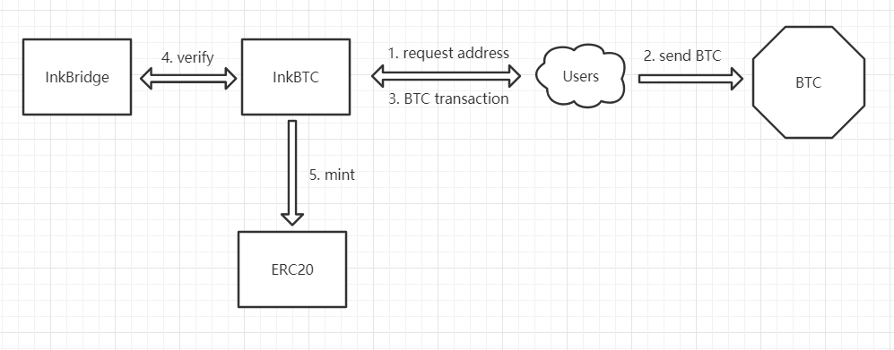

# 项目背景

当前区块链世界中有数千条公链，各个项目都有自己的创新。然而单个公链无法覆盖所有的应用场景，满足全部的创新需求。这也就使得跨链技术应运而生。跨链技术可以实现不同区块链之间的资产转移，读取验证其他链的状态和事件，提升区块链的处理能力。

当前区块链的跨链技术主要有公证人机制、侧链/中继链、哈希锁定。Polkadot就是以侧链/中继链实现跨链的技术代表。以substrate开发的平行链可以很方便地接入Polkadot网络。同时Polkadot提供转接桥服务来将已经存在的公链(如BTC、ETH等)接入波卡生态。

当前波卡生态内的转接桥项目主要有PolkaBTC、Snowfork等。在研究了这些项目后，我们发现当前的转接桥项目有如下不足：

1. 多在平行链的层面开发，需要通过拍卖获得插槽，成本较高
2. 大多停留在价值转移，而无法提供其他链状态等的验证，更无法为其他平行链链或合约提供自定义格式的交易验证
3. 一个项目只能转接一条公链，效率较低

综上所述，当前存在的转接桥项目可扩展性低而运行成本高。因而我们提出InkBridge项目。 InkBridge基于Ink语言编写，使用Wasm合约技术构建转接桥，可以部署到所有支持Wasm合约的平行链，把多条公链(BTC, ETH等)的转接桥下沉为平台，为上层应用提供链数据和状态的验证而不只停留于价值转移。社区项目方可以调用合约提供的接口将InkBridge接入自身项目实现更多的功能。在合约层面的实现大大提高了扩展性的同时也降低了接入成本。

InkBridge将首先接入BTC为其他合约提供基础的转接桥服务。同时为了更好地让项目方和开发者接入我们的项目，我们还提供了一个InkBTC的demo应用，实现了基础的BTC锁定和转移功能。

# 项目技术设计
## InkBridge

在InkBridge的架构中，主要包含有InkBridge合约、Relayer、前端、上层应用这四个部分。

### InkBridge合约
InkBridge合约是本项目中最为核心的部分，主要提供链信息存储和上层应用接口。

* 链信息存储

InkBridge合约是一个实现在合约层的轻节点，接受relayer提交的区块信息，对其中的区块难度等进行校验。校验成功后更新自身存储的最新区块并对Relayer分发奖励。

* 上层应用接口

InkBridge合约允许上层应用验证交易和区块，获取区块链的区块和交易信息。项目方可以提交交易哈希和对应的merkle tree信息来验证交易的合法性，从而实现自身的应用逻辑。InkBridge合约会对接入的项目方收取部分费用来支付Relayer和运营方维护的成本。

### Relayer
Relayer获取转接目标链的最新区块，将其提交给InkBridge合约。为了激励relayer提交区块，会给予提交成功的relayer奖励，但是只有最先提交的relayer会拿到合约的奖励。

### 前端
前端会实时向InkBridge合约请求内部存储信息，向用户展示Bridge中存储的区块链最新块头和来自其他项目方的验证请求与结果。

### 上层应用
上层应用通过调用InkBridge合约的接口来获取目标链的区块和交易信息，对相关信息进行验证来实现自身的逻辑。

## InkBTC

InkBTC是我们提供的示例demo，为项目方和开发者演示了如何通过和我们的InkBridge交互来将BTC转移至波卡网络。InkBTC的获取步骤如下。
1. 用户通过我们提供的前端向InkBTC合约发起一个获取BTC充值地址的请求。合约会返还给用户一个BTC地址。
2. 用户向获取到的地址发送的BTC。
3. 在交易被打包后用户将交易的哈希发送给InkBTC合约进行验证。
4. 合约收到交易验证请求后会向InkBridge合约发起交易验证请求，确保用户提交的验证交易已经被打包且不可逆。
5. InkBTC在确认交易的真实性后将对应的ERC20 BTC发送给用户想要充值的地址。

# 项目进展
当前项目已经基本完成，主要包括如下内容。
1. InkBridge 合约。合约可以接收relayer提交区块，对其进行验证后更新合约的最长链。同时也完成了提供给外部合约的接口，供项目方查询存储的链信息和对项目方传递的交易进行验证。
2. Relayer。已经完成一个Relayer客户端，可以利用该客户端向InkBridge合约提交最新的区块信息。
3. InkBridge 前端。已经完成InkBridge的前端，可以动态展示合约中存储的最长链信息和交易验证请求。
4. InkBTC示例应用。已经完成示例应用的前端和合约，可以将BTC转移至波卡平行链上。

# 技术难点与解决方案

# 项目规划

## 开发规划
1. 2021年第一季度实现转接桥对BTC的支持，并将转接桥和示例应用部署至Jupiter、Plasm等支持wasm合约的测试网供项目方和开发者测试

2. 2021年第二季度
* 收集项目方和开发者的建议，改进转接桥功能，完善示例应用，正式将InkBridge部署至Jupiter、Plasm等主网，供项目方接入
* 实现转接桥对ETH的支持并在测试网上对相关功能测试，保证功能完善后部署至主网供项目方接入
* 完善对项目方收取手续费和激励Relayer的经济模型以及社区治理的DAO模型

3. 后续开发计划
* 研究和开发对非POW链的转接

## 运营规划
* 完善开发文档，方便项目方和开发者接入项目以及其余Relayer节点部署
* 制定合理的治理模型，通过社区治理来决策项目关键参数以及新的转接桥接入等
* 寻求Patract，Plasm等知名wasm合约平台的合作，依托其平行链平台推广自身项目
* 将项目提交至各类DApp store和平台(如patrastore等)，提升项目知名度
* 建立开发者社群，接收来自项目方和开发者的建议改进产品

## 商业模式
* 团队为非盈利组织，所有收取的费用都将转入基金库用于支付relayer奖励和覆盖开发成本
* 在项目初期，团队会自身运行relayer节点保证InkBridge中存储链信息和目标链主网同步
* 在项目方接入到一定规模后，对项目方收取部分手续费，该笔费用会转入基金库。该基金库由社区的DAO组织来管理，会定期基于Relayer的表现给予奖励。开发团队则需要向基金会申请奖励用于覆盖自身开发成本。

# 市场定位及调研
## 市场定位
InkBridge是一个基于wasm合约技术提供跨链服务的底层平台。其主要目的是为波卡生态中的链上合约以及平行链提供跨链的信息传递和验证。在功能上，我们不满足于跨链的价值转递，而是更进一步实现了一个基于合约的轻节点，完成了目标链的迁移。在扩展性上，我们基于wasm合约编写，不仅可以部署到所有wasm合约平台，提供的合约接口更是大大降低了其余项目调用的成本。 我们与生态中其他的跨链项目（如PolkaBTC）并不构成竞争关系。相反其余跨链项目也可以使用我们的接口来辅助自身的开发。

## 市场调研
当前波卡生态中并没有提供跨链信息传递和验证的底层平台。其余跨链项目如PolkaBTC, 以及以太坊生态中的wBTC都是BTC价值锚定的项目，正如定位中提到的，这些项目和我们的项目并没有竞争关系。
* PolkaBTC

PolkaBTC基于波卡平行链，采用了XCLAIM框架开发。允许用户1:1锁定BTC并铸造PolkaBTC, 从而将BTC价值转移至波卡生态中。
* wBTC

wBTC等以太生态中的BTC跨链项目是中心化控制的双向锚定跨链项目。只能由具备完整KYC/AML资格的注册商家发起。