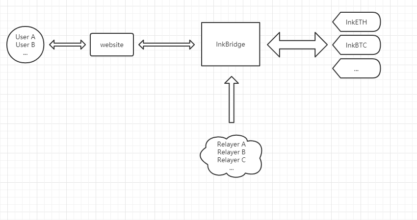

# 项目背景

当前区块链世界中有数千条公链，各个项目都有自己的创新。然而单个公链无法覆盖所有的应用场景，满足全部的创新需求。这也就使得跨链技术应运而生。跨链技术可以实现不同区块链之间的资产转移，读取验证其他链的状态和事件，提升区块链的处理能力。

当前区块链的跨链技术主要有公证人机制、侧链/中继链、哈希锁定。Polkadot就是以侧链/中继链实现跨链的技术代表。以substrate开发的平行链可以很方便地接入Polkadot网络。同时Polkadot提供转接桥服务来将已经存在的公链(如BTC、ETH等)接入波卡生态。

当前波卡生态内的转接桥项目主要有PolkaBTC、Snowfork等。在研究了这些项目后，我们发现当前的转接桥项目有如下不足：

1. 多在平行链的层面开发，需要通过拍卖获得插槽，成本较高
2. 大多停留在价值转移，而无法提供其他链状态等的验证，更无法为其他平行链链或合约提供自定义格式的交易验证
3. 一个项目只能转接一条公链，效率较低

综上所述，当前存在的转接桥项目可扩展性低而运行成本高。因而我们提出InkBridge项目。 InkBridge基于Ink语言编写，使用Wasm合约技术构建转接桥，可以部署到所有支持Wasm合约的平行链，把多条公链(BTC, ETH等)的转接桥下沉为平台，为上层应用提供链数据和状态的验证而不只停留于价值转移。社区项目方可以调用合约提供的接口将InkBridge接入自身项目实现更多的功能。

InkBridge将首先接入BTC为其他合约提供基础的转接桥服务。同时为了更好地让项目方和开发者接入我们的项目，我们还提供了一个InkBTC的demo应用，实现了基础的BTC锁定和转移功能。

# 项目技术设计
## InkBridge

在InkBridge的架构中，主要包含有InkBridge合约、Relayer、前端、上层应用这四个部分。

### InkBridge合约
InkBridge合约是本项目中最为核心的部分，主要提供链信息存储和上层应用接口。

* 链信息存储

InkBridge合约是一个实现在合约层的轻节点，接受relayer提交的区块信息，对其中的区块难度等进行校验。校验成功后更新自身存储的最新区块并对Relayer分发奖励。

* 上层应用接口

InkBridge合约允许上层应用验证交易和区块，获取区块链的区块和交易信息。项目方可以提交交易哈希和对应的merkle tree信息来验证交易的合法性，从而实现自身的应用逻辑。InkBridge合约会对接入的项目方收取部分费用来支付Relayer和运营方维护的成本。

### Relayer
Relayer获取转接目标链的最新区块，将其提交给InkBridge合约。只有最先提交的relayer会拿到合约的奖励。

### 前端
前端向用户展示Bridge中存储的区块链信息和来自其他项目方的验证请求与结果。

### 上层应用
上层应用通过调用InkBridge合约的接口来获取目标链的区块和交易信息，对相关信息进行验证来实现自身的逻辑。

## InkBTC

# 项目进展

# 技术难点与解决方案

# 黑客松期间进展

# 项目规划

## 未来6个月的商业规划
## 市场定位及调研
## 现在拥有的资源及调研